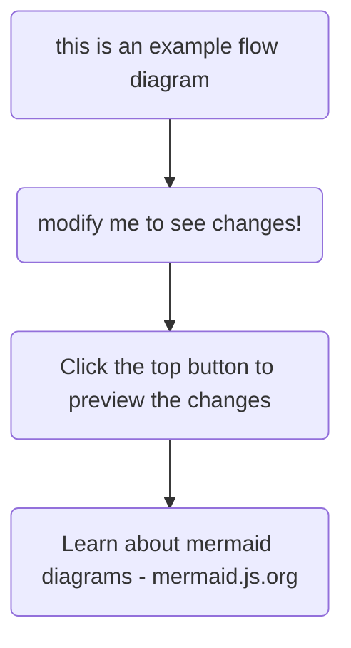

# La FGMM-CFDT affirme

La FGMM-CFDT affirme que la prime d’ancienneté, les primes

d'astreintes, les primes de travail en équipe, les primes de nuit,

etc., doivent être exclues de l'appréciation du Salaire minimum, et

sont en supplément.

Sinon, comment compenser ces contraintes, s’il n'y a pas de

différence de salaire entre un salarié de nuit et un salarié de jour ?

# L’organisation patronale

L’organisation patronale soutient que les primes d'ancienneté

prévues par accord d'entreprise et les

primes liées aux organisations du travail

doivent être incluses dans le calcul du

salaire minimum conventionnel.

La FGMM-CFDT dénonce l’absurdité de cette interprétation

[https://cfdt-fgmm.fr/wp-content/uploads/AFFICHE-ARTCLE-140.pdf](https://cfdt-fgmm.fr/wp-content/uploads/AFFICHE-ARTCLE-140.pdf)

